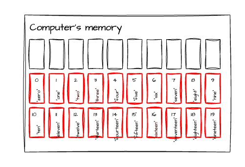
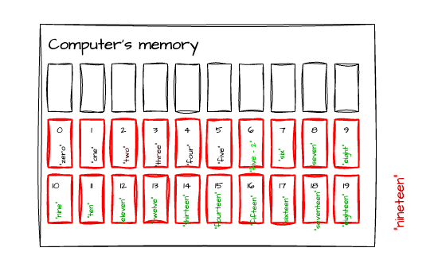
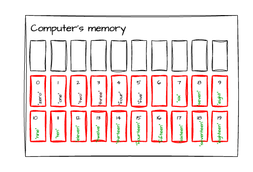

# Array

Array is a data structure to store something in the computer's memory and do
something to it.
An array is like a list with some limitations and quirky things.


The picture above shows a simplified version of the computer's memory. The
single memory addresses are marked as boxes.

An array represents a contiguous space in the computer's memory meaning when the array is
initialized a certain part of the memory is dedicated to the array.
The size of the box depends on the type.
In practice, it means we say the computer the following:
`"Give me memory space for 20 int type and I'll refer to myIntArray name"`.

```cs
int[] myIntArray = new int[20];
```

An array is always fixed size, and its size has to be provided at initialization.
The values of the array are set to highly probably null or default value of the type.

An array always zero indexed, meaning the first element is always under the
index 0.


# Operations and their complexities in a single-thread environment

| Operation                | Time Complexity | Space complexity |
|--------------------------|-----------------|------------------|
| [Add/Append](#addappend) | `O(N)`          | `O(N)`           |
| [Insert](#insert)        | `O(N)`          | `O(N)`           |
| [Overwrite](#overwrite)  | `O(1)`          | `O(1)`           |
| [Remove](#remove)        | `O(N)`          | `O(N)`           |
| [Delete](#delete)        | `O(1)`          | `O(1)`           |
| [Search](#search)        | `O(N)`          | `O(1)`           |

## Add/Append

Since the array is fixed size [add/append](introduction.md#addappend) operation includes
resizing the array.
The software engineer has to ensure that the resizing is executed successfully and contains
the elements of the array, and the new, added, element is added as last one.
This, from practical point of view, does not make a lot of sense, especially when the
language, for example java or c# provides a variable size array data structure.

Add/Append operation **time complexity** is due to resize is `O(N)` and **space complexity** is
`O(N)` too as it requires allocating a new array.

## Insert

The key in the [insert](introduction.md#insert) operation is that 1, the size of the data
structure increases and 2,
every item following the index to where the new item is inserted will be shifted right
by one.
As a result the software engineer has to pay attention to keep the original order of the
elements, adding a new one, adding the shifted elements and that the new array has an
increased size.

The two screenshots picture an insert operations where the `"five-2"` value will be inserted
into the `6th` index and everything after this index will be pushed right.
Since the array is already full there is no place for the last item to be shifted to.
It is either a silent data loss or some type of error message from the language runtime.





As a summary, we can say that in worst case the `insert` operation requires going through the
array once.
In order to shift the array elements another array is needed with the same size as the
original array, in worst case.
As a conclusion, the time complexity of the `insert` operation is **linear** in worst case.
The space complexity is also **linear**.

## Overwrite

From usage point of view when the code consist of `myIntArray[2] = 10` it might seem we are
adding the `10` to the array, but in reality we overwrite whatever is under the index `2`
by the value of `10`.

A real [add](introduction.md#addappend) operation does not exist for an array without resize.

The code below show array initialization and that values under `3`, `4`, and `15` are
overwritten by the provided values.

```c#
// initialization of the array
strin[] string_array = new[20];
// adding value 14 to the index 3 place in the array
string_array[3]="asd";
string_array[4]="foo";
string_array[15]="bar";
```

The code above results what is displayed in the screenshot below.
Pay attention to the zero indexing.


Overwrite operation is a **constant** time operation since we know where is the value we
want to work with within the array (index).

## Remove

Remove operation is about removing the designated item and shifting all following elements
in the array to left by one.

The screenshots below show the before and after state of the `remove` operation.


When the item under index `7` in the array gets removed all the elements following it
needs to be shifted left.
The last slot of the array, index `19`, will have default value.


The worst case **time complexity** is `O(N)` because every element in the array need to be
moved.
The worst case **space complexity** is `O(N)` because the resizing portion of the operation
requires the allocation of another, similar size array.

## Delete

In reality, there is no such thing to remove an element from an array.
The `delete` operation sets the value at the designated index to array default, which in
many cases `null`.
The screenshots show this process.


```java
string[] string_array = new[20];

string_array[6]=null;
```



The **time complexity** of this operation is `O(1)` since we know the index of the element we
want to delete.
The **space complexity** of this operation is also `O(1)` because overwriting the element
in the array does not require extra memory space.

## Searching for an element

Finding an element in the array means that every item in the array needs to be checked
if fits for the search criteria.
In general, it requires a `for` or `foreach` loop or something similar from the fancy
lamba functions.
But, the fact is that in worst case every element has to be checked.
It means that the time complexity of the search operation is **linear** while the space
complexity is **constant**.

# Considerations

When it comes to arrays worth to consider the followings:

- accessing elements is a fast operation, for this we have to know under which index is placed the
  element we wish to work with
- searching can be slow
- in general arrays don't have as rich api as, for example,
  an [ArrayList (Java)](https://docs.oracle.com/javase/8/docs/api/java/util/ArrayList.html) or
  a [List (C#)](https://learn.microsoft.com/en-us/dotnet/api/system.collections.generic.list-1?view=net-8.0)
- changing and managing the size of arrays is error-prone, slow and requires additional space
- the contiguous nature of array is a two-edged sword:
    - it can give memory pressure to the system which has to find a place in the memory
      where the array can be fit. This can be made worse by some size management.
    - due to cache locality 1, arrays can be faster than hashmaps if the array size is small,
      but this is a corner case, 2, in a streaming use case it can be advantageous

# Links

> [!Video https://www.youtube.com/embed/YQs6IC-vgmo?si=X664x0z9ynWEJe8c]